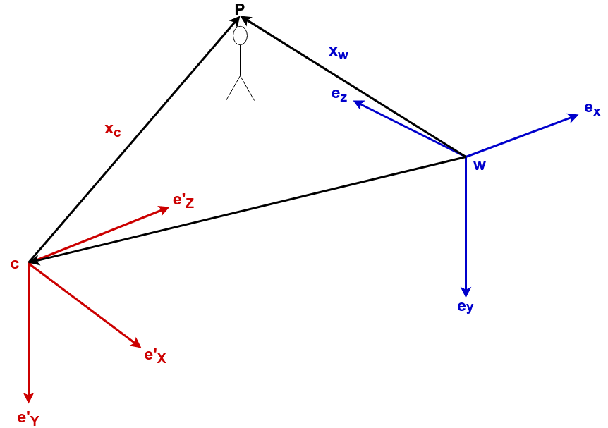

# 問題設定

## 各種表記

| 意味                                      | 定義                                      |
|:------------------------------------------|:------------------------------------------|
| 画像領域                                  | \\(\Omega \subset \mathbb{R}^2\\)         |
| ピクセル座標                              | \\(\mathbf{u} = (u, v)^{\top}\\)          |
| ピクセル座標のhomogeneous表現             | \\(\dot{\mathbf{u}} = (u, v, 1)^{\top}\\) |
| カメラの内部パラメータ                    | \\(K\\)                                   |
| 逆深度 (深度の逆数)                       | \\(\xi_{r} \colon \Omega \rightarrow \mathbb{R}\\)                |
| RGB画像                                   | \\(I_{r}\colon \Omega \rightarrow \mathbb{R}^3 \\)                |
| 3次元座標から画像座標への射影             | \\(\pi((x, y, z)^{\top}) = (x / z, y / z)^{\top}\\)               |
| 画像座標から3次元座標への射影 (dは逆深度) | \\(\pi^{-1}(\mathbf{u}, d) = \frac{1}{d}K^{-1}\dot{\mathbf{u}}\\) |

## カメラ姿勢の記述
基準となるフレーム\\(w\\)に対するカメラ\\(c\\)の姿勢を

$$
T_{wc} 
= \begin{bmatrix} 
    R_{wc} & \mathbf{c}_{w} \\
    \mathbf{0}^{\top} & 1
\end{bmatrix},\, T_{wc} \in \mathbb{SE}(3)
$$

で定義する．

ここで\\(R_{wc} \in \mathbb{SO}(3)\\)は姿勢の回転を表す行列であり，\\(\mathbf{c}_w \in \mathbb{R}^3\\)は並進を表すベクトルである．

位置座標\\(c\\)から見たある点を\\(\mathbf{x}_c\\)，位置座標\\(w\\)から見た同じ点を\\(\mathbf{x}_w\\)とすると，\\(\mathbf{x}_c\\)と\\(\mathbf{x}_w\\)は$$\mathbf{x}_{w} = T_{wc}\mathbf{x}_{c}$$という式で関連付けられる．

 

## 目標

### 3次元復元
画像の任意のピクセルに\\(\mathbf{u}\\)おける深度(逆深度) \\(d = \xi(\mathbf{u})\\) を推定する．

### トラッキング
現在のカメラ姿勢 \\(T_{wl}\\) を推定する．
